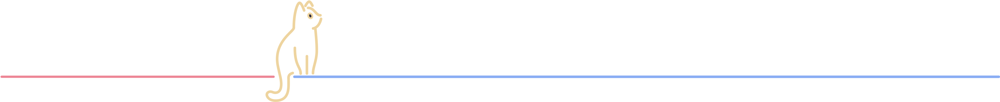

<!--  -->

<h5></h5>

<h1 align="center">
  
</h1>

<h4 align="center">
    Passionate Software Developer | Open Window Graduate
</h4>

  
  
  
  
  

## 🛠️ Technologies & Tools

Frontend

<!-- Frontend Omitted -->
<!--  -->
<!--  -->
<!--  -->
<!--  -->
<!--  -->
<!--  -->

Backend

Database & Cloud

Development Tools

Design Tools

APIs & Services

## 📌 Featured Projects

    
    

        

            
            
        

    

    <h5></h5>
    

        
    

    <h5></h5>
    

        
    

    <h5></h5>
    

        
    

<h5></h5>

## 📊 GitHub Stats

  

## 📫 Contact Me

- 📧 Email: dieter.dieter.no1@gmail.com
- 💼 LinkedIn: <a href="https://www.linkedin.com/in/dieter-roelofse-4769152a0/" target="_blank">LinkedIn Profile</a>

---

  <h3>✨ Always learning, always coding!</h3>

